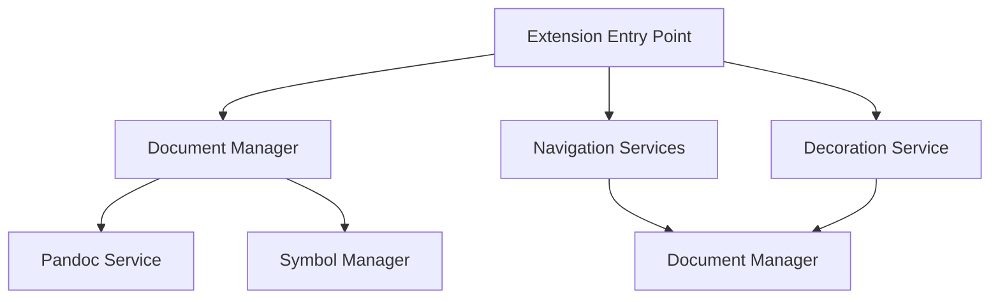

# EntangleD VSCode Extension - Technical Design Document

## 1. System Overview

EntangleD VSCode is a Visual Studio Code extension that implements literate programming support, allowing developers to write code inside Markdown files while maintaining full IDE capabilities.

### 1.1 Core Functionality
- Parse and process Markdown files containing EntangleD code blocks
- Provide code navigation features (definition, references)
- Support real-time code block visualization
- Enable symbol lookup and outline view
- Manage code decorations and hover information

## 2. Architecture

### 2.1 High-Level Components

### 2.2 Key Components

#### Extension Entry Point (`extension.ts`)
- Manages extension lifecycle
- Initializes core services
- Registers VS Code providers
- Handles document events

#### Document Manager (`document/manager.ts`)
- Parses and manages literate programming markup
- Maintains document state
- Coordinates with Pandoc service

#### Navigation Services (`navigation/providers.ts`)
- Handles identifier definitions and references
- Manages symbol overview and search
- Provides hover information
- Focus on literate programming entities

#### Decoration Service (`services/decoration-provider.ts`)
- Handles visual representation of entities
- Updates decorations in real-time
- Customizable highlighting styles

## 3. Data Flow

### 3.1 Document Processing Flow
1. User opens/modifies Markdown file
2. Document Manager processes the file
3. Pandoc parses Markdown structure
4. Navigation providers update their indices
5. Decoration provider refreshes visual elements

### 3.2 Navigation Flow
1. User triggers navigation action
2. Relevant provider handles the request
3. Document Manager provides necessary context
4. VS Code UI updates accordingly

## 4. Key Design Decisions

### 4.1 Singleton Pattern Usage
- Document Manager: Ensures single source of truth for document state
- Decoration Provider: Centralizes decoration management
- Rationale: Maintains consistency and prevents state conflicts

### 4.2 Event-Driven Architecture
- Uses VS Code's event system for document changes
- Enables real-time updates and responsiveness
- Reduces coupling between components

### 4.3 Pandoc Integration
- External dependency for Markdown processing
- Provides robust Markdown parsing capabilities
- Enables future extensibility for different formats

## 5. Extension Points

### 5.1 Language Support
- Designed to be language-agnostic
- New language support can be added through VS Code's language server protocol

### 5.2 Code Block Processors
- Extensible system for handling different code block types
- Can be extended for custom block formats

## 6. Performance Considerations

### 6.1 Document Processing
- Asynchronous processing to prevent UI blocking
- Caching of parsed documents
- Incremental updates when possible

### 6.2 Memory Management
- Document disposal when files are closed
- Efficient storage of parsed content
- Cleanup of unused resources

## 7. Security Considerations

### 7.1 File System Access
- Restricted to workspace scope
- Uses VS Code's security model
- No arbitrary code execution

### 7.2 External Process Management
- Controlled Pandoc execution
- Input validation for all external calls

## 8. Testing Strategy

### 8.1 Unit Tests
- Component-level testing
- Mock VS Code API where necessary
- Focus on core processing logic

### 8.2 Integration Tests
- End-to-end extension testing
- VS Code extension host testing
- Document processing verification

## 9. Future Considerations

### 9.1 Planned Improvements
- Enhanced error handling and recovery
- Performance optimizations for large documents
- Additional language-specific features

### 9.2 Potential Extensions
- Custom code block processors
- Additional navigation features
- Enhanced visualization capabilities
