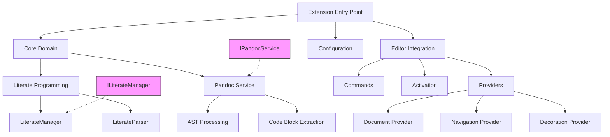

# EntangleD VSCode Extension - Technical Design Document

## 1. System Overview

EntangleD VSCode is a Visual Studio Code extension that implements literate programming support, allowing developers to write code inside Markdown files while maintaining full IDE capabilities.

### 1.1 Core Functionality
- Parse and process Markdown files containing EntangleD code blocks
- Provide code navigation features (definition, references)
- Support real-time code block visualization
- Enable symbol lookup and outline view
- Manage code decorations and hover information

## 2. Architecture

### 2.1 High-Level Components

### 2.2 Key Components

#### Core Domain (`/src/core`)
- **Literate Programming**: Core domain logic for literate programming entities
  - Manages code block parsing and relationships
  - Handles dependency tracking
  - Provides core interfaces for the system
- **Pandoc Service**: Integration with Pandoc for Markdown processing
  - Handles document parsing
  - Manages Pandoc communication

#### Editor Integration (`/src/editor`)
- **Providers**: VS Code integration points
  - Navigation providers (definition, references, hover)
  - Symbol provider for outline view
  - Decoration provider for visual enhancements
- **Commands**: User command handlers
  - Navigation commands
  - Document processing commands
- **Activation**: Extension lifecycle management
  - Initialization logic
  - Resource cleanup

#### Configuration (`/src/config`)
- Default settings
- User configuration management
- Extension preferences

#### Utilities (`/src/utils`)
- Logging infrastructure
- Common helper functions
- Shared utilities

## 3. Data Flow

### 3.1 Document Processing Flow
1. User opens/modifies Markdown file
2. Document Manager processes the file
3. Pandoc parses Markdown structure
4. Navigation providers update their indices
5. Decoration provider refreshes visual elements

### 3.2 Navigation Flow
1. User triggers navigation action
2. Relevant provider handles the request
3. Core domain provides necessary context
4. VS Code UI updates accordingly

## 4. Key Design Decisions

### 4.1 Clean Architecture
- Clear separation of concerns between core domain and editor integration
- Domain logic isolated from VS Code specifics
- Dependency inversion through interfaces

### 4.2 Event-Driven Architecture
- Uses VS Code's event system for document changes
- Enables real-time updates and responsiveness
- Reduces coupling between components

### 4.3 Pandoc Integration
- External dependency for Markdown processing
- Provides robust Markdown parsing capabilities
- Enables future extensibility for different formats

## 5. Extension Points

### 5.1 Language Support
- Language-agnostic core domain
- Extensible through VS Code's language server protocol
- Support for custom code block formats

### 5.2 Provider System
- Modular provider architecture
- Easy to add new VS Code capabilities
- Extensible decoration system

## 6. Performance Considerations

### 6.1 Document Processing
- Asynchronous processing to prevent UI blocking
- Efficient caching of parsed documents
- Incremental updates when possible

### 6.2 Memory Management
- Proper resource cleanup
- Efficient storage of parsed content
- Smart cache invalidation

## 7. Security Considerations

### 7.1 File System Access
- Restricted to workspace scope
- Uses VS Code's security model
- No arbitrary code execution

### 7.2 External Process Management
- Controlled Pandoc execution
- Input validation
- Secure configuration handling

## 8. Testing Strategy

### 8.1 Unit Tests
- Core domain testing
- Provider behavior verification
- Mock VS Code API where necessary

### 8.2 Integration Tests
- End-to-end extension testing
- VS Code extension host testing
- Document processing verification

## 9. Future Considerations

### 9.1 Planned Improvements
- Enhanced error handling and recovery
- Performance optimizations for large documents
- Additional language-specific features

### 9.2 Potential Extensions
- Custom code block processors
- Additional navigation features
- Enhanced visualization capabilities
