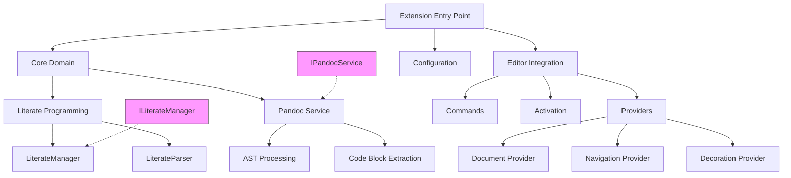
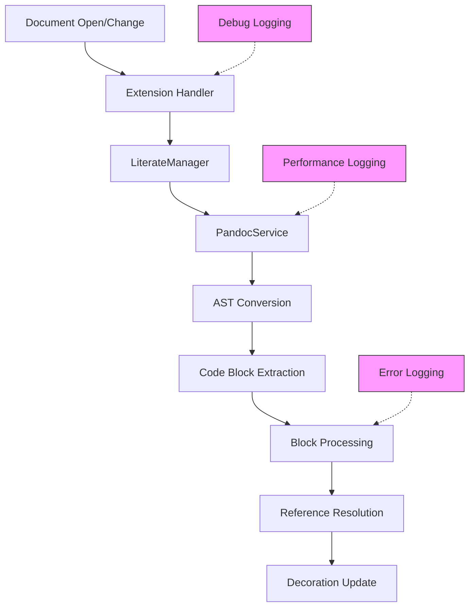

# EntangleD VSCode Extension - Technical Design Document

## 1. System Overview

EntangleD VSCode is a Visual Studio Code extension that implements literate programming support, allowing developers to write code inside Markdown files while maintaining full IDE capabilities.

### 1.1 Core Functionality
- Parse and process Markdown files containing EntangleD code blocks
- Provide code navigation features (definition, references)
- Support real-time code block visualization
- Enable symbol lookup and outline view
- Manage code decorations and hover information

## 2. Architecture

### 2.1 High-Level Components



### 2.2 Key Components

#### Extension Entry Point (`extension.ts`)
- Manages extension lifecycle
- Initializes core services
- Registers VS Code providers
- Handles document events
- Provides comprehensive error handling and logging

#### Document Manager (`document/manager.ts`)
- Parses and manages literate programming markup
- Maintains document state
- Coordinates with Pandoc service
- Tracks block dependencies and references

#### Navigation Services (`navigation/providers.ts`)
- Handles identifier definitions and references
- Manages symbol overview and search
- Provides hover information
- Focus on literate programming entities

#### Decoration Service (`services/decoration-provider.ts`)
- Handles visual representation of entities
- Updates decorations in real-time
- Customizable highlighting styles
- Efficient update debouncing

## 3. Data Flow

### 3.1 Document Processing Flow


### 3.2 Error Handling & Logging
- Hierarchical error system with specific error types
- Comprehensive debug logging (configurable via settings)
- Performance metrics and statistics
- Clear error messages with context
- Stack trace preservation

Error Types:
- EntangledError (Base)
- PandocError (Pandoc processing)
- DocumentParseError (Markdown parsing)
- BlockNotFoundError (Missing references)
- BlockSyntaxError (Code block issues)
- CircularReferenceError (Dependency cycles)

### 3.3 Logging Categories
1. **Lifecycle Events**
   - Extension activation/deactivation
   - Provider registration
   - Command registration

2. **Document Processing**
   - File open/change events
   - Parse operations
   - Block extraction
   - Reference resolution

3. **Performance Metrics**
   - Processing times
   - Block counts
   - Memory usage
   - Cache statistics

4. **Error Conditions**
   - Parse failures
   - Missing references
   - Circular dependencies
   - Invalid syntax

## 4. Extension Points

### 4.1 Language Support
- Designed to be language-agnostic
- Pandoc integration for Markdown processing
- Extensible block parsing system

### 4.2 Code Block Processors
- Customizable block format handling
- Language-specific features
- Reference resolution strategies

## 5. Performance Considerations

### 5.1 Document Processing
- Asynchronous operations
- Efficient caching
- Debounced updates
- Memory management

### 5.2 Logging & Diagnostics
- Configurable debug logging
- Performance tracking
- Memory usage monitoring
- Error aggregation

## 6. Configuration
```json
{
    "entangled.debugLogging": {
        "type": "boolean",
        "default": false,
        "description": "Enable debug logging"
    }
}
```

## 7. Future Considerations

### 7.1 Planned Improvements
- Enhanced error recovery
- Performance optimizations
- Additional language features

### 7.2 Potential Extensions
- Custom block processors
- Advanced navigation
- Visualization enhancements
